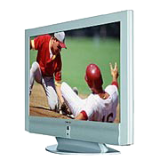

= PART THREE: Customizing Default VERBS

== Changing the Default Response

[float]
=== Better Responses

We have created several OBJECTS and placed them in the TV Room: the TV, the chair, and the table.
We have seen how the library provides responses to commands like "look at", "turn on", and "take" the OBJECTS.

Now it is time to learn how to modify the responses for each OBJECT.
We will start with the "look at" command, found in the library's "examine.i" file ( not the "look.i" file, which "looks" at the LOCATION; we want to "look at", or "examine" the OBJECTS).
Again, the relevant sections are highlighted in #yellow#.

// @ALAN @LIBRARY:
// - [ ] ENABLE HIGHLIGHTING FOR LIBRARY
// - [ ] RESTORE COLOR NOTATION
// - [ ] CHECK CODE
[subs="quotes"]
----
 -- examine.i
 -- Library version 0.5.0
 -- 0.4.1 - converted to ALANv3
 #ADD TO EVERY THING#
     #IS#
         #examinable.#
         #searchable.#
 #END ADD TO THING.#
 ADD TO EVERY ACTOR
     IS
         NOT searchable.
 END ADD TO ACTOR.
 ----
 #SYNONYMS#
     #x, inspect, 'check' = examine.#
 #SYNTAX#
     #examine = examine (obj) *#
  WHERE obj ISA THING
    ELSE "You can't examine that!"
 #SYNTAX#
     #examine = 'look' 'at' (obj) *#
 #Add To Every thing#
     #Verb examine#
         #Check obj Is examinable#
         #Else#
             #"You can't examine" Say The obj. "."#
         #Does#
             #"There is nothing special about" Say The obj. "."#
     #End Verb.#
 #End Add To.#
 ...
----

[float]
=== An OBJECT Is a THING

Every OBJECT (and every ACTOR) in the game is in the sub-class, if you will, of the larger class, THING (which itself is a sub-class of ENTITY).
It may help to understand this from the chart in the Alan manual (page 32), reproduced here:

.Relationships between the predefined classes.
image::{assets-img}predefined-classes.svg[predefined classes, align="center"]

The "examine.i" file says:

// @ALAN @LIBRARY:
// - [ ] ENABLE HIGHLIGHTING FOR LIBRARY
// - [ ] RESTORE COLOR NOTATION
// - [ ] CHECK CODE
[subs="quotes"]
----
 ...
 ADD TO EVERY THING
     IS
         examinable.
         searchable.
 END ADD TO THING.
 ...
----

Every OBJECT, then, as a THING, is by default "examinable" and "searchable" (we will look at the "search" statement later).
The SYNONYMS for "examine" include "x" (the common IF convention for "examine"), "inspect", and " 'check' " ( _see the information below on using Alan_ _reserved programming words)_ .
Any of these words typed by the player will be the same to the interpreter as though the player had typed "examine".

Now there is something new here:

// @ALAN @LIBRARY:
// - [ ] ENABLE HIGHLIGHTING FOR LIBRARY
// - [ ] RESTORE COLOR NOTATION
// - [ ] CHECK CODE
[subs="quotes"]
----
 ...
 SYNTAX
     examine = 'look' 'at' (obj) *.
 ...
----

We will look at the SYNTAX construction in detail later.
What is important to see at this point is that this is not the same as a single-word SYNONYM for "examine".
This SYNTAX construction allows for a multiple-word command, "look at", applied to the OBJECT (obj), meaning the same thing to the interpreter as "examine" .

// @ALAN @LIBRARY:
// - [ ] ENABLE HIGHLIGHTING FOR LIBRARY
// - [ ] RESTORE COLOR NOTATION
// - [ ] CHECK CODE
[subs="quotes"]
----
 ...
 Add To Every thing
     Verb examine
         Check obj Is examinable
         Else
             "You can't examine" Say The obj. "."
         Does
             "There is nothing special about" Say The obj. "."
     End Verb.
 End Add To.
 ...
----

Finally we come to the command itself.
Every OBJECT, as a THING, will respond to the command, or VERB, "examine", according to this section of code in "examine.i".
First the interpreter will CHECK if the OBJECT (obj) has the Attribute ("Is") "examinable".
Then, passing that CHECK, the interpreter DOES the action of the VERB, which in this case is to respond, "There is nothing special about" and then Say The OBJECT.
And so:

[example,role="gametranscript"]
================================================================================
*TV Room* +
This is your favorite room in the house, because you love to watch
television. You recently purchased a giant screen plasma TV that is
set up in this room, ideally located across from your comfy chair and
table. The kitchen is south.

&gt; _look at the tv_ +
There is nothing special about the TV.

&gt; _look at the chair_ +
There is nothing special about the comfy chair.

&gt; _look at the table_ +
There is nothing special about the table.
================================================================================

[float]
=== Changing the Default Response

We can change the "nothing special" response with one of our own for each of our OBJECTS.
The simplest way to do that right now is to begin with the "copy-and-paste" method.
Let's copy and paste the VERB from "examine.i" into our OBJECTS.
This is the section we want from "examine.i":

// @ALAN @LIBRARY:
// - [ ] ENABLE HIGHLIGHTING FOR LIBRARY
// - [ ] RESTORE COLOR NOTATION
// - [ ] CHECK CODE
[subs="quotes"]
----
     Verb examine
         Check obj Is examinable
             Else
                 "You can't examine" Say The obj. "."
         Does
             "There is nothing special about" Say The obj. "."
     End Verb.
----

The only part we need is the VERB statement, and what it DOES.
So before we paste it into our game file, let's remove the CHECK, etc.

IMPORTANT: This doesn't mean the CHECKS will not apply to our OBJECTS.
The CHECKS will still be applied by default.

// @ALAN @LIBRARY ?????:
// - [ ] ENABLE HIGHLIGHTING FOR LIBRARY
// - [ ] RESTORE COLOR NOTATION
// - [ ] CHECK CODE
[subs="quotes"]
----
 Verb examine
     Does
         "There is nothing special about" Say The obj. "."
 End Verb.
----

We can also remove the unwanted response, leaving us with:

// @ALAN @EXAMPLE:
// - [ ] ENABLE HIGHLIGHTING FOR EXAMPLES
// - [ ] RESTORE COLOR NOTATION
// - [ ] CHECK CODE
----
 Verb examine
     Does
         ""
 End Verb.
----

Now let's paste this into the section for each of our OBJECTS:

// @ALAN @TV-TIME:
// - [ ] ENABLE HIGHLIGHTING
// - [ ] RESTORE COLOR NOTATION
// - [ ] CHECK CODE
[subs="quotes"]
----
 ...
 SYNONYMS television = tv.
 THE tv Isa OBJECT AT tv_room
     NAME TV
     NAME plasma
     NAME screen
     NAME giant
     NAME giant screen plasma tv
     IS SWITCHABLE.
     HAS weight 100.
     DESCRIPTION
     [green]#Verb examine
         Does
             ""
     End Verb.#
 END THE tv.
 -----------------------
 THE chair Isa OBJECT AT tv_room
     NAME comfy chair
     NAME comfy
     DESCRIPTION
     [green]#Verb examine
         Does
             ""
     End Verb.#
 END THE chair.
 -----------------------
 THE table Isa OBJECT AT tv_room
     DESCRIPTION
     [green]#Verb examine
         Does
             ""
     End Verb.#
 END THE table.
 -----------------------
 ...
----

Now let's put in our custom responses:

// @ALAN @TV-TIME:
// - [ ] ENABLE HIGHLIGHTING
// - [ ] RESTORE COLOR NOTATION
// - [ ] CHECK CODE
[subs="quotes"]
----
 ...
 SYNONYMS
     television = tv.
 THE tv Isa OBJECT AT tv_room
     NAME TV
     NAME plasma
     NAME screen
     NAME giant
     NAME giant screen plasma tv
     IS SWITCHABLE.
     HAS weight 100.
     DESCRIPTION
     Verb examine
         Does
             [green]#"It's your 52-inch plasma pride and joy."#
     End Verb.
 END THE tv.
 -----------------------
 THE chair Isa OBJECT AT tv_room
     NAME comfy chair NAME comfy
     DESCRIPTION
     Verb examine
         Does
             [green]#"It's your favorite chair to sit in when you're watching
              the big game."#
     End Verb.
 END THE chair.
 -----------------------
 THE table Isa OBJECT AT tv_room
     DESCRIPTION
     Verb examine
         Does
             [green]#"It's an ordinary table, set conveniently by your chair."#
     End Verb.
 END THE table.
 -----------------------
 ...
----

Save, compile and run the game. "Look at" the TV.

[example,role="gametranscript"]
================================================================================
*TV Room* +
This is your favorite room in the house, because you love to watch
television. You recently purchased a giant screen plasma TV that is
set up in this room, ideally located across from your comfy chair and
table. The kitchen is south.

&gt; _look at the tv_
There is nothing special about the TV. It's your 52-inch plasma pride and joy. +
================================================================================

We still got the default response and our custom response.
What happened?

Note what was said above about the CHECK.
Even though we removed it from the VERB for each of our OBJECTS, the CHECK is still carried out by the default VERB in the "examine.i" file.
The same holds true for the DOES.
The default DOES in the library is carried out, and then the custom DOES for the OBJECT is carried out.

If we want the interpreter to do only what the custom response calls for, we add the word ONLY .
Like this:

// @ALAN @TV-TIME:
// - [ ] ENABLE HIGHLIGHTING
// - [ ] RESTORE COLOR NOTATION
// - [ ] CHECK CODE
[subs="quotes"]
----
 ...
 Verb examine
     Does [green]#ONLY#
         "It's your 52-inch plasma pride and joy."
 End Verb.
 ...
----

Include the word "ONLY" in each of the custom VERB responses for the tv, chair, and table.
Compile and play the game, examining each.
The game will display only the custom responses!

[[reserved]]
== Reserved words

Notice the single-quotes around the word "check", as well as the words "look" and "at", in "examine.i".
This is very _important_!
We know that CHECK and AT are reserved Alan programming words, or keywords .
When the Alan program sees a CHECK or any Alan keyword, it tries to understand it as a statement, which will most likely result in a compiler error.
But that does not preclude us from using Alan keywords for our own purposes.
The single-quotes around the keyword will protect it from being interpreted as a statement, and will allow its use as though it were not a keyword.

[[take]]
== Another Take on "take"

Previously we worked with various default responses for the "take"command, using the tv as our test OBJECT.
First we made the tv "NOT takeable", resulting in the default response:

[example,role="gametranscript"]
================================================================================
&gt; _take the tv_ +
You can't take that!
================================================================================

Then we gave the tv the Attribute of weight, and gave it a weight of 100.

[example,role="gametranscript"]
================================================================================
&gt; _take the tv_ +
That is too heavy to lift.
================================================================================

There is still another way to override the default responses for "take", and that is to supply a custom response of our own, as we did in the last section with the "examine" VERB.
Let's copy and paste the relevant section from the "take" VERB in "take.i":

// @ALAN @LIBRARY:
// - [ ] ENABLE HIGHLIGHTING FOR LIBRARY
// - [ ] RESTORE COLOR NOTATION
// - [ ] CHECK CODE
[subs="quotes"]
----
 Verb take, pick_up1, pick_up2
     Check obj Is takeable
         Else "You can't take that!"
     And obj Not In worn
         Else "You've already got that - you're wearing that."
     And obj Not In hero
         Else "You've already got that."
     And weight Of obj &lt;=50
         Else "That is too heavy to lift."
     Does
         Locate obj In hero.
         "Taken."
 End Verb.
----

Let's remove the CHECKS and paste the remaining code in the tv OBJECT.

// @ALAN @TV-TIME:
// - [ ] ENABLE HIGHLIGHTING
// - [ ] RESTORE COLOR NOTATION
// - [ ] CHECK CODE
[subs="quotes"]
----
 ...
 SYNONYMS
     television = tv.
 THE tv Isa OBJECT AT tv_room
     NAME TV
     NAME plasma
     NAME screen
     NAME giant
     NAME giant screen plasma tv
     IS SWITCHABLE.
     [green]#-- We removed the "HAS weight 100" to keep the
     -- default CHECK from stopping the "take" action.#
     DESCRIPTION
     Verb examine
         Does ONLY
             "It's your 52-inch plasma pride and joy."
     End Verb.
     [green]#Verb take, pick_up1, pick_up2
         Does ONLY -- We don't want the default DOES to apply!
             Locate obj In hero.
             "Taken."
     End Verb.#
 END THE tv.
 ...
----

Look at the line that says "Locate obj In hero." The LOCATE statement is new.
Its purpose is to move or locate an OBJECT or ACTOR (including the player character, if we wish) from one place to another.
The place can be a LOCATION, a CONTAINER, near another OBJECT, etc., depending on other factors.

In this case the "take" action will LOCATE the tv (obj) "In hero".

_The Hero is the default player character,_ and is also _the default player's inventory CONTAINER_.
That is, anything carried by the Hero (the player character) is said to be IN the Hero.
So to LOCATE the tv IN the Hero means that the tv will no longer be in the TV Room, but be carried by the player character.

To prevent the tv from being moved into the player inventory, we simply omit the LOCATE statement from the "take" VERB.

// @ALAN ?????:
// - [ ] ENABLE HIGHLIGHTING
// - [ ] RESTORE COLOR NOTATION
// - [ ] CHECK CODE
[subs="quotes"]
----
 ...
 Verb take, pick_up1, pick_up2
     Does ONLY
         "Taken."
 End Verb.
 ...
----

The default LOCATE will not apply because it is in the DOES section of the default VERB.
We are overriding _everything_ in the DOES section of the default VERB with DOES ONLY.

Of course the "Taken" message makes no sense now.
We can put a custom message in its place.

// @ALAN @TV-TIME:
// - [ ] ENABLE HIGHLIGHTING
// - [ ] RESTORE COLOR NOTATION
// - [ ] CHECK CODE
[subs="quotes"]
----
 ...
 SYNONYMS
     television = tv.
 THE tv Isa OBJECT AT tv_room
     NAME TV
     NAME plasma
     NAME screen
     NAME giant
     NAME giant screen plasma tv
     IS SWITCHABLE.
     DESCRIPTION
     Verb examine
         Does ONLY
             "It's your 52-inch plasma pride and joy."
     End Verb.
     Verb take, pick_up1, pick_up2
         Does ONLY
             [green]#"You try to wrap your arms around the giant screen
              but it is too wide. You can't get a good grip on the
              heavy TV to lift it."#
     End Verb.
 END THE tv.
 ...
----

In effect, we have stopped the action by overriding the default response.
This same effect could be achieved with a CHECK in the place of the DOES ONLY, but I prefer this method as it allows greater flexibility as the program becomes more complex.

== Turn It On

Let's do one more custom response to a default VERB in the library, turning the tv on and off.
We'll start by looking once again at "turn.i" and copying what we need for the tv and removing the CHECKS.

// @ALAN @LIBRARY:
// - [ ] ENABLE HIGHLIGHTING FOR LIBRARY
// - [ ] RESTORE COLOR NOTATION
// - [ ] CHECK CODE
[subs="quotes"]
----
 Verb turn_on1, turn_on2, switch_on1, switch_on2
     Does
         Make obj 'on'.
         "You turn on" Say The obj. "."
 End Verb.
----

Remember at this point in the "take" VERB (xref:take[previous section]) we came to the LOCATE statement after the DOES.
This time we have come to something else new in the line "Make obj on."
_The MAKE statement changes a Boolean Attribute_.

The MAKE statement does not Add an Attribute, but changes it.
The OBJECT in question must already have the Attribute, either that it IS, or IS NOT.
As noted before, a Boolean Attribute can be thought of in terms of on/off, yes/no.
The MAKE statement is used to turn the on to off, the yes to no, the right_side_up to upside_down, etc.
It does so by making the ON to NOT ON, the YES to NOT YES, the RIGHT_SIDE_UP to NOT RIGHT_SIDE_UP, and so on, and vice versa.

We had to give the tv the Attribute "IS SWITCHABLE" so that the player can turn it on or off.
But we did not have to give the tv the Attribute of " on " (an Alan reserved word), because it already has it.
That is, the tv has the Attribute IS NOT ON.
We did not have to assign that Attribute to the tv in our code, because the default library ("turn.i") has already assigned it to every OBJECT in the game:

// @ALAN @LIBRARY:
// - [ ] ENABLE HIGHLIGHTING FOR LIBRARY
// - [ ] RESTORE COLOR NOTATION
// - [ ] CHECK CODE
[subs="quotes"]
----
 Add To Every object
     Is
         Not 'on'.
         Not switchable.
 End Add To object.
----

What an OBJECT IS NOT can be changed to IS, and what it IS can be changed to IS NOT, with the MAKE statement.

// @ALAN @LIBRARY:
// - [ ] ENABLE HIGHLIGHTING FOR LIBRARY
// - [ ] RESTORE COLOR NOTATION
// - [ ] CHECK CODE
[subs="quotes"]
----
 Verb turn_on1, turn_on2, switch_on1, switch_on2
    Does
        Make obj 'on'.
        "You turn on" Say The obj. "."
 End Verb.
----

So the line "Make obj on" will change the Attribute of the tv from NOT ON to ON.
In fact, it will MAKE the tv ON two times: once in the default library and once in our VERB for the tv.
Once we add the DOES ONLY, however, we override everything in the default DOES, and it will only be changed in the local VERB for the tv.

A further bit of house cleaning comes into play here, however.
The word "obj" is a stand-in for the OBJECT, in this case the tv.
It will work fine as it is, making the tv ON.
But to make the code easier to understand, especially as it may become more complex, we do well to let the tv stand in for itself.

// @ALAN @TV-TIME:
// - [ ] ENABLE HIGHLIGHTING
// - [ ] RESTORE COLOR NOTATION
// - [ ] CHECK CODE
[subs="quotes"]
----
 Verb turn_on1, turn_on2, switch_on1, switch_on2
    Does [green]#ONLY
        Make tv# 'on'.
        "You turn on" Say The obj. "."
 End Verb.
----

Finally we will write our custom message response.
We could say "You turn on the tv," but that would be the very same message as the default library.
If that is all we wanted, we would have done well enough to assign the IS SWITCHABLE Attribute to the tv and be done.
The default library would take care of the rest.

But we want to do more than say "You turn on the tv." We want this display:

[example,role="gametranscript"]
================================================================================
&gt; _turn on the tv_ +
Wow! What a great picture!

[.float-group]
--

You watch the game and your favorite team wins!

And so have you...
--

{3ast} You have won! {3ast}

Do you want to UNDO, RESTART, RESTORE or QUIT?
================================================================================

Next part will show how we do it.
